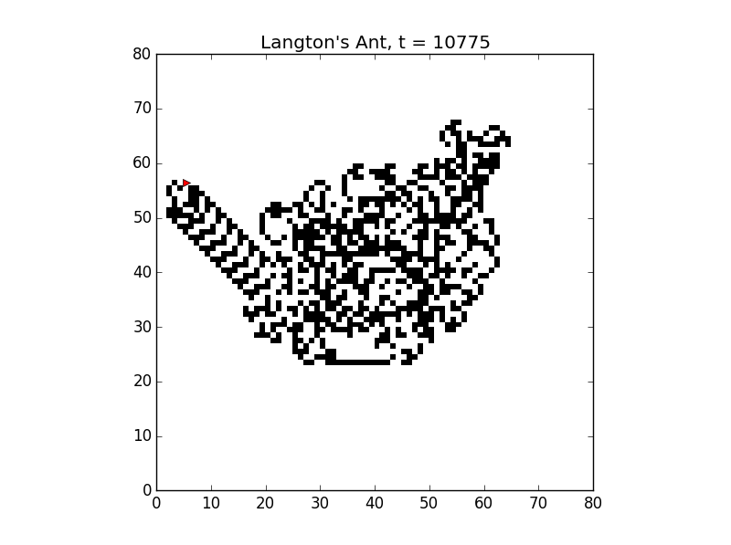
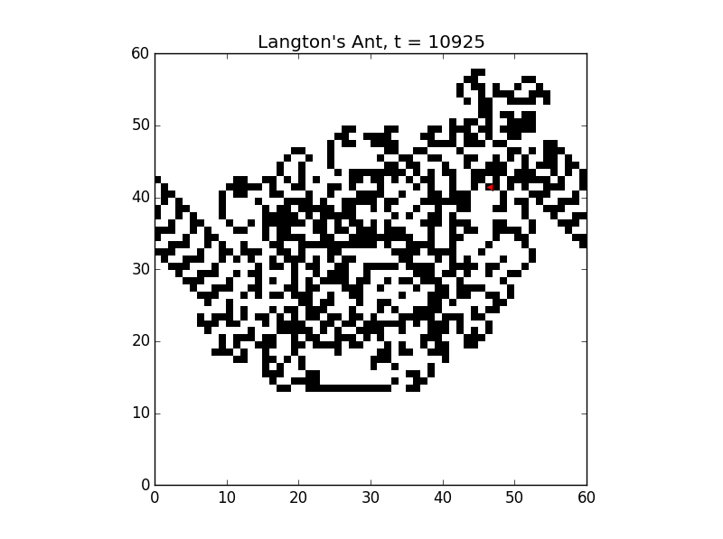
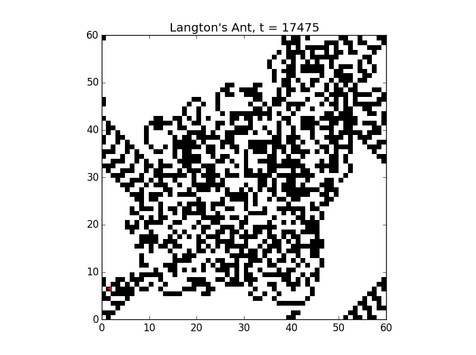
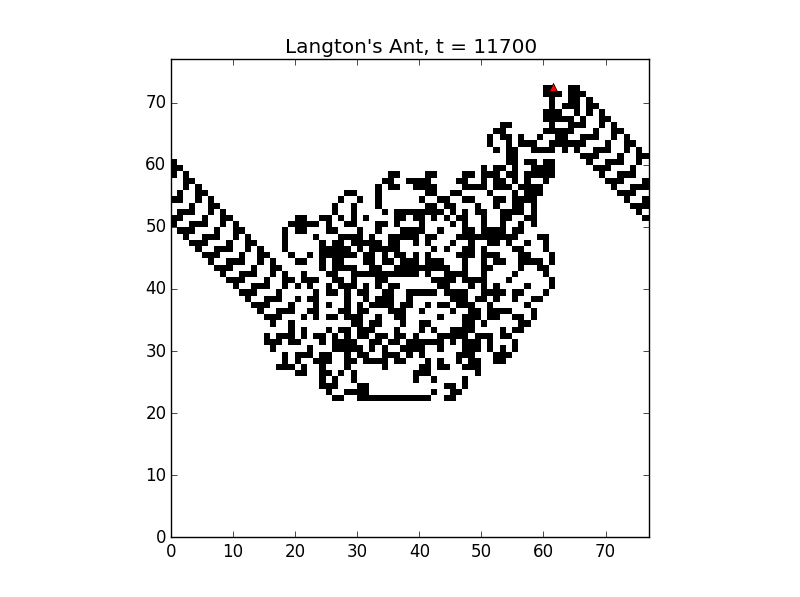

# langton-ant :white_large_square::white_large_square::white_large_square::white_large_square::white_large_square::ant::black_large_square::white_large_square::black_large_square::white_large_square::black_large_square:

This is a Py-CX implementation of Langton's Ant. Following the traditional tripartite structure of py-cx, there are three primary functions in the script: initialize, observe, and update. These carry out operations on two classes of objects: world, which encodes the cells of the environment; and langton, which is the ant class that stores a position and heading. Variable parameters within py-cx include the size of the world, whether the world wraps, and the time step to begin the visualization at. Since py-cx already includes the ability to change the step size for renewing the visualization, this enables the viewer to observe any part of the Langton's Ant sequence for any size of observable world while minimizing the computational drain.

The Langton's Ant model is known for finding an attractor that results in a ''highway'' leading off in a single direction. While this is perhaps surprising given the seemingly random motion of the first 10,000 steps, what is more surprising to me is that this is not the only time this behavior happens.  

Running the model with a grid size of 60 and with wrapping turned on, it becomes clear that this ''highway'' steady state is readily achievable under many different circumstances. After 10,900 time steps with a grid size of 60, the old steady state collides with the mess around the origin point. 

At 17000 time steps, a new ''highway'' is formed going to the upper right of the screen. Rather than being a unique confluence of factors, it appears that this emergent behavior can be achieved under multiple different starting conditions. 

A final point - the world size matters for values smaller than 77. This is the size at which the ''highway'' does not collide with the central noise. Beyond this point, the physical state of the center of the world will remain the same until the point at which the entire map fills up. Below this point, each subtle change in the world size results in a differen collision trajectory, which leads to new states. 
